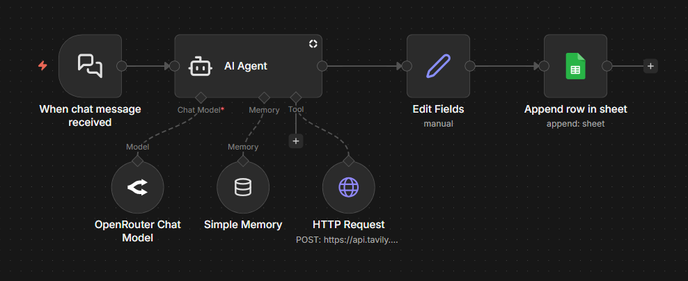

# AI Web Research Assistant (n8n + Tavily)

Perplexity-style AI web research assistant built using **n8n**, **LLMs**, and the **Tavily Search API**.  
This project demonstrates how to build a cost-effective AI search workflow that performs real-time web research and logs results automatically.

---

## 🚀 Features

- 🔎 Real-time web search using Tavily
- 🤖 Perplexity-style AI agent behavior
- 🧠 LLM-powered answer synthesis
- 🗂️ Automatic logging of questions & answers to Google Sheets
- ⚡ Built entirely in n8n (low-code / no-code)
- 🔁 Supports follow-up questions

---

## 🧩 Workflow Overview

**Flow:**

1. User sends a chat query
2. AI Agent decides whether web search is required
3. Tavily API performs live web search
4. LLM synthesizes a concise answer
5. Question & Answer are logged to Google Sheets
6. Final response is returned to the user

---
## 🧠 Workflow Architecture

This diagram shows the complete AI web research pipeline:
- Chat trigger receives user query
- AI Agent decides when to search
- Tavily API performs real-time web search
- LLM synthesizes answer
- Question & Answer are logged to Google Sheets

## 🛠️ Tech Stack

- **n8n** – Workflow automation & AI orchestration  
- **Tavily API** – Real-time web search  
- **LLM (OpenRouter / OpenAI-compatible)** – Answer generation  
- **Google Sheets** – Persistent storage  

---

## 📥 Import Workflow into n8n

1. Download the workflow JSON file from this repository:
2. Open your n8n instance
3. Click **Import Workflow**
4. Upload the JSON file
5. Configure credentials (see below)
6. Activate the workflow

---

## 🔑 Required Configuration

### Tavily
- `TAVILY_API_KEY`

### LLM Provider
- OpenRouter / OpenAI compatible API key

### Google Sheets
- Google Sheets OAuth credentials
- Spreadsheet columns:
- `Timestamp`
- `Question`
- `Answer`

---

## 📊 Google Sheets Logging Format

Each query is logged as:

| Timestamp | Question | Answer |
|---------|----------|--------|
| 2026-01-17 | What is n8n? | n8n is an open-source workflow automation platform... |

---

## 💬 Example

**User:**  
> What is n8n?

**Assistant:**  
> n8n is an open-source workflow automation platform that allows you to connect APIs and services using a visual interface.

---

## ⚠️ Notes

- Search depth is intentionally limited to reduce API cost
- Designed for factual, concise answers
- One web search per query (configurable)

---

## 🔮 Future Improvements

- Multi-source citations
- Session memory
- Cost tracking
- Frontend chat UI

---

## 👤 Author

**Dayanand Shettar**  
GitHub: https://github.com/dayananddaya  

---

⭐ If you find this useful, consider starring the repository!
